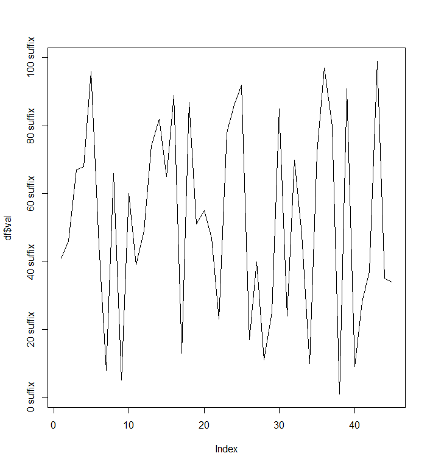
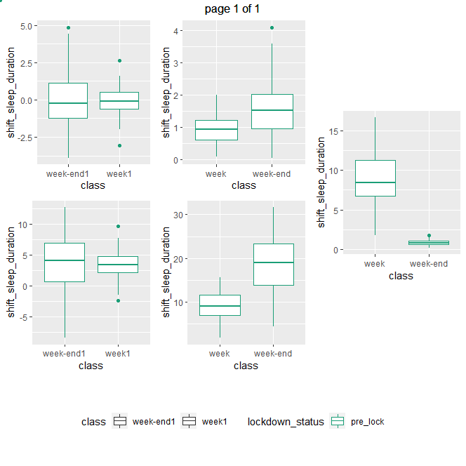
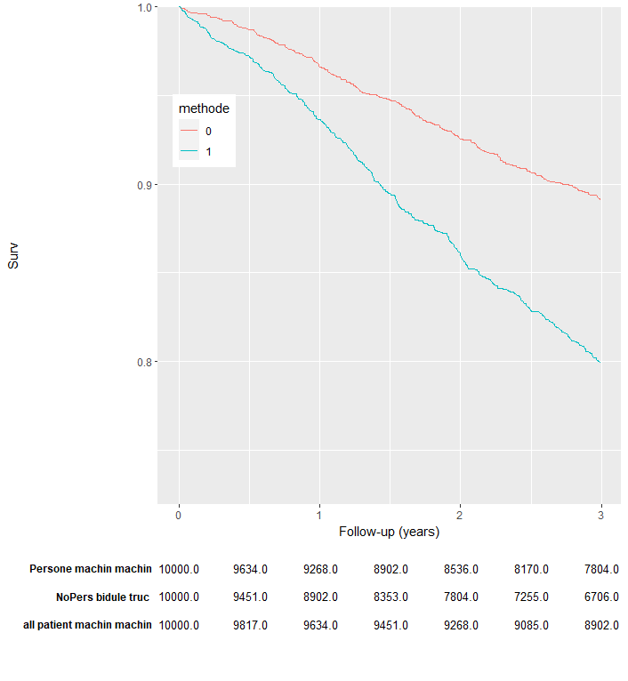

# Question_programmation

Ce Repo contient des exemples simples de comment réaliser les graphique et tableau présenté ci-dessous des opérations ci-dessous.

## Modalité d'ajout.

Pour être considéré comme valable, un nouvel ajout doit répondre aux spécifications suivantes :
* Être ajouté dans le dossier correspondant au langage de programmation.
* Être ajouté dans la sous-section correspondante de ce Readme avec :
    * Le nom du graphique avec un lien vers le code associé.
    * Une image du résultat.
    * Une brève description
* Les exemples doivent être exécutables seuls sans données associées. Il est donc recommandé d'utiliser le jeu de données IRIS, quand cela est impossible utiliser des données simulées dans le script.

## Language R
### Graphique

[Changer les valeurs de l'axe des Y](R/graphique/add_suffix_to_label.R)

Ajout d'un suffixe après chaque élément de l'axe des Y

[Plusieurs plots côte à côte avec une seule légende](R/graphique/multiple_odd_plot_side_by_side_one_legend.R)

mettre un nombre impair de plots côte à côte avec le plot seul centré et une seule légende.

[Tableau sous un plot aligné avec l'axe des X](R/graphique/ajout_tableau.R)

Ajout d'un tableau sous l'axe des X dont les colonnes sont alignées avec l'axe des X.

### Table

## Language python

# Question_programmation

Ce Repo contient des exemples simples de comment réaliser les graphique et tableau présenté ci-dessous des opérations ci-dessous.

## Modalité d'ajout.

Pour être considéré comme valable, un nouvel ajout doit répondre aux spécifications suivantes :
* Être ajouté dans le dossier correspondant au langage de programmation.
* Être ajouté dans la sous-section correspondante de ce Readme avec :
    * Le nom du graphique avec un lien vers le code associé.
    * Une image du résultat.
    * Une brève description
* Les exemples doivent être exécutables seuls sans données associées. Il est donc recommandé d'utiliser le jeu de données IRIS, quand cela est impossible utiliser des données simulées dans le script.

## Language R
### Graphique

[Changer les valeurs de l'axe des Y](R/graphique/add_suffix_to_label.R)

Ajout d'un suffixe après chaque élément de l'axe des Y

[Plusieurs plots côte à côte avec une seule légende](R/graphique/multiple_odd_plot_side_by_side_one_legend.R)

mettre un nombre impair de plots côte à côte avec le plot seul centré et une seule légende.

[Tableau sous un plot aligné avec l'axe des X](R/graphique/ajout_tableau.R)

Ajout d'un tableau sous l'axe des X dont les colonnes sont alignées avec l'axe des X.

### Table

## Language python
